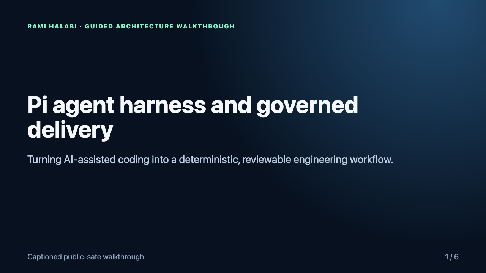
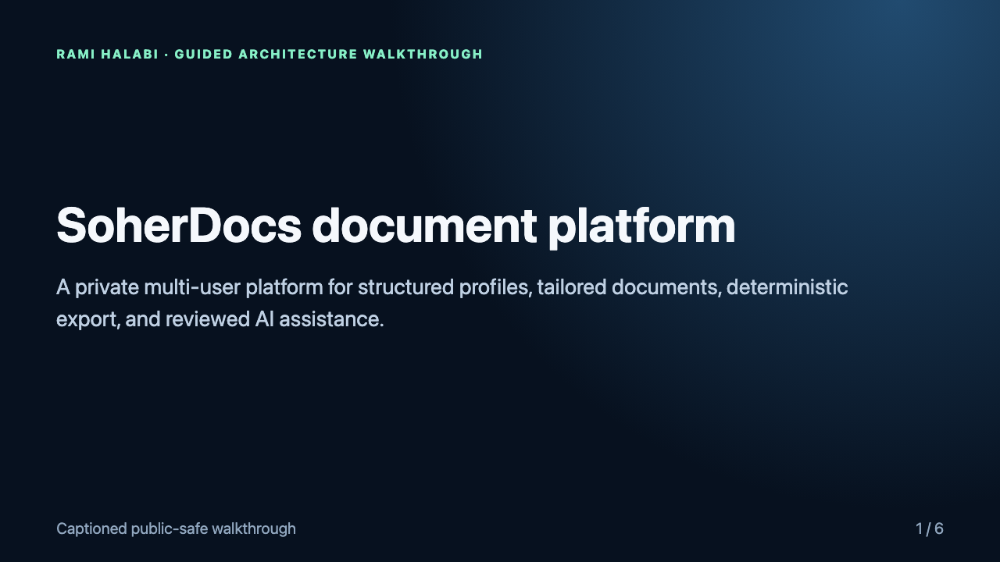

# Rami Halabi — AI Agent & Software Engineering Portfolio

I am a Technical Customer Success Manager and former IT Manager who also builds full-stack software and governed AI-agent tooling. This portfolio presents two independently developed projects through public-safe architecture, delivery, testing, and security case studies.

> **Private source available for supervised review. Temporary read-only access can be arranged for a technical interviewer after scope confirmation.**

## Runtime demos and evidence

### Pi agent harness — actual core execution

The Pi evidence includes a visual recording of an executable, public-safe scenario and the focused test run:

- **[Watch the embedded Pi runtime recordings](https://raal1600.github.io/ai-agent-portfolio/projects/pi-agent-harness.html#runtime-title)**
- [Play or download the contract-accurate Full YOLO workflow](evidence/pi-agent-harness/full-yolo-workflow.webm)
- [View the completed Full YOLO workflow frame](evidence/pi-agent-harness/full-yolo-workflow-poster.png)
- [Inspect the machine-readable workflow and contract evidence](evidence/pi-agent-harness/full-yolo-workflow-result.json)
- [Play or download the focused verification WebM](evidence/pi-agent-harness/pi-agent-harness-runtime.webm)
- [View the final verification frame](evidence/pi-agent-harness/pi-runtime-poster.png)
- [Read the complete evidence record](evidence/pi-agent-harness/runtime-evidence.md)
- [Inspect the machine-readable runtime result](evidence/pi-agent-harness/runtime-behavior.json)
- [Inspect the public-safe runtime scenario](evidence/pi-agent-harness/runtime-scenario.mjs)
- [Read the genuine 138/138 Node test-runner output](evidence/pi-agent-harness/pi-extension-tests.txt)
- [Verify the hashed source snapshot](evidence/pi-agent-harness/source-snapshot.sha256)

The scenario imports and executes the actual private control and delivery modules with synthetic inputs. It verifies capability gating, duplicate-dispatch prevention, canonical queue enforcement, cross-process lease contention, pause/resume behavior, and completed-work replay prevention.

### SoherDocs — actual browser runtime

- **[Watch the embedded application demo](https://raal1600.github.io/ai-agent-portfolio/projects/soherdocs.html#runtime-title)**
- [Play or download the WebM capture](evidence/soherdocs/soherdocs-application-export-runtime.webm)
- [Read the complete evidence record](evidence/soherdocs/runtime-evidence.md)
- [Inspect the machine-readable assertions](evidence/soherdocs/runtime-result.json)

## Case studies

### [Pi agent harness and governed delivery extensions](case-studies/pi-agent-harness.md)

A TypeScript/Node.js extension suite for the Pi coding-agent harness. It adds custom tools, lifecycle events, interactive controls, deterministic workflow state, resumable sessions, bounded multi-agent execution, Obsidian-backed knowledge workflows, and fail-closed safety boundaries.

- 8,566 lines of reviewed non-test TypeScript/JavaScript source
- 3,122 lines of tests
- 138 extension tests passing in the captured run
- Human approval retained for sensitive transitions

**[Runtime evidence: actual core execution and genuine 138-test Node runner output](evidence/pi-agent-harness/runtime-evidence.md)**

### [SoherDocs document platform](case-studies/soherdocs.md)

A multi-user Next.js and PostgreSQL platform for producing structured, tailored documents with authenticated profiles, private artifacts, deterministic rendering, and audited AI-assisted features.

- Next.js, React, TypeScript, Node.js, PostgreSQL, and Drizzle ORM
- Authentication, ownership checks, rate limiting, private storage, and export
- Layered unit, visual, browser, and end-to-end test gates
- Decoupled service boundaries designed for maintainable handover

**[Runtime evidence: actual Playwright/Chromium application-export flow](evidence/soherdocs/runtime-evidence.md)**

## What this portfolio demonstrates

- Building working MVPs while preserving clear architectural seams
- Turning AI-assisted coding into reviewable, deterministic engineering workflows
- Selecting practical tools based on security, operability, and maintainability
- Designing human approval, recovery, and handover into agent-enabled systems
- Explaining complex technical decisions to Product Owners and cross-functional teams

## Verification and access

The public repository contains sanitized case studies plus runtime artifacts captured from the real private systems with synthetic data. The implementation source remains private. During a supervised technical review I can:

1. Walk through selected source modules and architectural decisions.
2. Run focused automated tests and explain failure/recovery behavior.
3. Demonstrate the Pi control plane, Obsidian integration, and SoherDocs flows using non-sensitive data.
4. Arrange time-bounded read-only repository access for an agreed reviewer when appropriate.

## Contact

[LinkedIn — Rami Halabi](https://www.linkedin.com/in/rami-halabi-2a5573195/)
