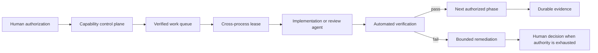

# Soher agent system and governed delivery extensions

## Problem

AI coding agents can work quickly, but enterprise delivery requires more than generation speed. Agent runs need explicit authority, predictable state transitions, bounded concurrency, durable recovery, human approvals, and evidence that another engineer can inspect.

## Solution

I designed and built Soher, a private TypeScript/Node.js governed agent system on the Pi coding-agent framework. Soher operates through specialized coordinator, implementer, and reviewer forms and treats agent execution as a controlled delivery system rather than an unrestricted autonomous process.



## Components

### YOLO control plane

- Interactive session-scoped capability selection
- Separate permission auto-approval, Obsidian auto-write, routing optimization, session continuity, and delivery controls
- Visible status and pause/resume behavior
- Explicit authorization for bounded remediation increases

### Governed delivery engine

- Deterministic implementation, review, remediation, and reconciliation phases
- Cross-process leases and heartbeats to prevent duplicate ownership
- Durable session checkpoints and resumable execution
- Bounded parallel execution with a maximum of two isolated child tasks
- Soher Coordinator-owned integration and knowledge-base mutations
- Hard stops for commits, deployment, destruction, scope expansion, and unauthorized next-batch work

### Obsidian knowledge integration

- Bounded filesystem-first retrieval rather than unrestricted vault reads
- Path, traversal, wildcard, hidden-file, and symlink protections
- Preview and human approval before mutations
- Digest-bound folder operations that revalidate the approved manifest before an atomic move
- Deterministic inventory publication with fixed destinations and atomic writes

### Hermes pane bridge

- Manages one explicitly selected adjacent terminal surface
- Verifies terminal topology and process state before reconnect operations
- Refuses to replace live or unknown processes
- Exposes read-only connection status to the agent

## Representative design pattern

The following is intentionally simplified representative code, not copied private source:

```ts
type Phase = "implement" | "review" | "remediate" | "reconcile";

type Authority = {
  batchAuthorized: boolean;
  currentTicket: string;
  phase: Phase;
  allowCommit: false;
  allowDeploy: false;
  allowDestruction: false;
};

function canDispatch(authority: Authority, lease: LeaseState): boolean {
  if (!authority.batchAuthorized) return false;
  if (!lease.owned || lease.expired) return false;
  if (authority.allowCommit || authority.allowDeploy || authority.allowDestruction) return false;
  return true;
}
```

The important pattern is that execution is admitted only from explicit authority and current lease state; permissive defaults are avoided.

## Verification evidence

[View the captured runtime evidence, machine-readable core behavior, source snapshot manifest, and genuine Node test-runner output.](../evidence/pi-agent-harness/runtime-evidence.md)

Reviewed local inventory on 22 July 2026:

| Measure | Result |
|---|---:|
| Non-test TypeScript/JavaScript source | 8,566 lines |
| Test source | 3,122 lines |
| Combined extension suite | 11,688 lines |
| Focused Node tests | 138 passing |

The tests cover session persistence, inode/symlink races, deterministic state transitions, cross-process lease contention, stale ownership, bounded remediation, queue validation, Obsidian path safety, digest-bound moves, atomic writes, and shutdown recovery.

## Enterprise relevance

- **Security:** least-authority execution and fail-closed validation
- **Scalability:** deterministic coordination across concurrent Pi processes
- **Maintainability:** explicit state machines, focused modules, and extensive regression tests
- **Adoption:** interactive controls, visible status, documented phases, and supervised handover
- **Pragmatism:** automation stops when evidence or authority becomes ambiguous

## Private review

**Private source available for supervised review. Temporary read-only access can be arranged for a technical interviewer after scope confirmation.**

A supervised review can include selected modules, focused test execution, a synthetic workflow, and discussion of security trade-offs without exposing private prompts, notes, credentials, or unrelated local configuration.
