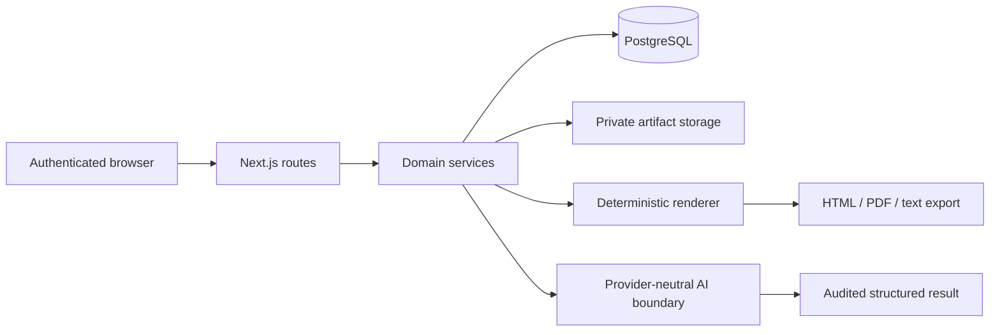

# SoherDocs document platform

## Problem

Producing tailored professional documents repeatedly is error-prone when content, formatting, privacy, and export logic are mixed together. A useful platform needs deterministic output, private user data, clear ownership, and AI assistance that remains auditable and replaceable.

## Solution

I architected and built a private multi-user web platform using Next.js, TypeScript, Node.js, PostgreSQL, and Drizzle ORM. It separates profile data, application workflows, rendering, exports, storage, and AI-assisted operations behind tested service boundaries.



## Main capabilities

- Structured profile and role-variant management
- Tailored CV and cover-letter workflows
- HTML, PDF, and plain-text export
- Authenticated multi-user access and ownership enforcement
- Private artifact handling and bounded preview state
- Local and AI-assisted job-ad analysis
- ATS scoring and reviewed profile import
- Audited AI execution with explicit application of suggestions

## Architecture decisions

### Decoupled infrastructure seams

Rendering, storage, preview state, rate limiting, and AI execution are isolated behind interfaces. This keeps product logic independent from deployment-specific implementations and makes later platform changes reviewable.

### Ownership and privacy

User-owned resources are loaded through repository/service boundaries and checked before access. The design minimizes persisted raw input, keeps generated artifacts private, and prevents browser access to provider or infrastructure credentials.

### Deterministic document output

Structured data is passed into a server-side renderer and exported through a replaceable PDF boundary. Visual, overflow, and browser tests protect document quality rather than relying only on unit tests.

### AI as a reviewed capability

AI features return bounded, structured suggestions. Existing profile or document state changes only through an explicit application step. Provider execution remains behind an adapter boundary so product behavior is not tied to one model vendor.

## Representative service boundary

The following is intentionally simplified representative code, not copied private source:

```ts
interface DocumentRenderer {
  render(input: StructuredProfile, variant: RoleVariant): Promise<RenderedDocument>;
}

interface PrivateArtifactStore {
  put(ownerId: string, artifact: RenderedDocument): Promise<ArtifactReference>;
  get(ownerId: string, artifactId: string): Promise<RenderedDocument>;
}

async function exportOwnedDocument(command: ExportCommand): Promise<ArtifactReference> {
  const profile = await profiles.requireOwned(command.userId, command.profileId);
  const rendered = await renderer.render(profile, command.variant);
  return artifacts.put(command.userId, rendered);
}
```

## Quality strategy

The project uses layered verification:

- TypeScript type checking and production builds
- Unit and service tests
- Golden rendering tests
- Visual and overflow checks
- Authenticated end-to-end tests
- Browser smoke scenarios for user-visible flows
- Database migration/schema gates where persistence changes

The private project contains a broad automated suite across unit, service, visual, browser, and end-to-end surfaces. Exact collection and gate results are available during supervised review rather than asserted from this source-free public repository.

[View the actual Playwright/Chromium application-export runtime capture and machine-readable assertions.](../evidence/soherdocs/runtime-evidence.md)

## Enterprise relevance

- **Rapid MVP delivery:** working vertical slices from profile input to deterministic export
- **Architecture:** replaceable infrastructure and provider boundaries
- **Security:** authentication, ownership, private artifacts, validation, and rate limits
- **Ways of working:** documented slice plans, CI gates, review standards, and explicit out-of-scope controls
- **Handover:** versioned plans and test-backed contracts that reduce reliance on one developer

## Private review

**Private source available for supervised review. Temporary read-only access can be arranged for a technical interviewer after scope confirmation.**

A supervised review can include selected route/service/repository boundaries, deterministic export, test execution, and a non-sensitive product demonstration.
