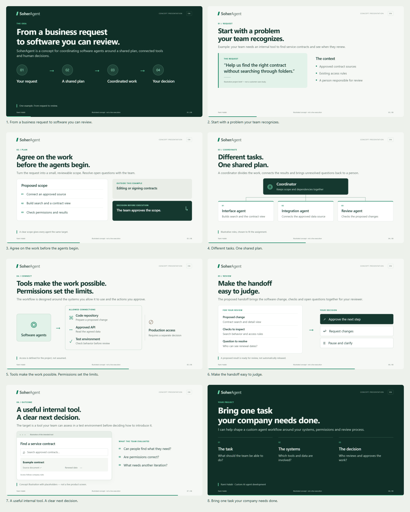
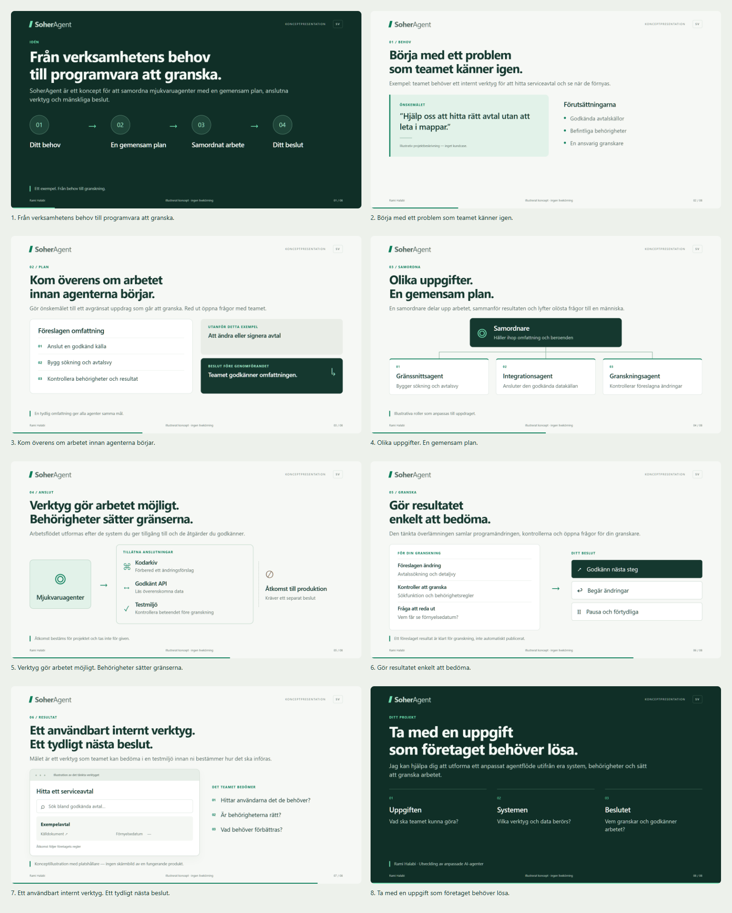

# SoherAgent visual storyboard — review before recording

Eight slides, in English and Swedish, rendered from the local Slidev project.
This proposal follows one illustrative software assignment: an internal tool
for finding service contracts. It describes the intended workflow, not a live
execution, customer case study or completed contract-search product.

**Open `index.html` locally for full-size slides with an English/Swedish toggle.**
No server is needed. On GitHub, open the overview images below, then individual
PNGs for a closer look. This review is not published to GitHub Pages.

| English overview | Swedish overview |
| --- | --- |
| [](en-overview.png) | [](sv-overview.png) |

| Slide | Purpose | English | Swedish |
| --- | --- | --- | --- |
| 1 | Explain the overall idea | [Open](en-01.png) | [Öppna](sv-01.png) |
| 2 | Introduce the business request | [Open](en-02.png) | [Öppna](sv-02.png) |
| 3 | Agree on scope and boundaries | [Open](en-03.png) | [Öppna](sv-03.png) |
| 4 | Explain coordinator and task agents | [Open](en-04.png) | [Öppna](sv-04.png) |
| 5 | Show approved tools and permissions | [Open](en-05.png) | [Öppna](sv-05.png) |
| 6 | Make the human decision explicit | [Open](en-06.png) | [Öppna](sv-06.png) |
| 7 | Illustrate the intended result | [Open](en-07.png) | [Öppna](sv-07.png) |
| 8 | Invite a concrete project discussion | [Open](en-08.png) | [Öppna](sv-08.png) |

## Source and approach

- Bilingual copy: `presentations/review/soheragent-story.mjs`.
- Scoped Vue visuals: `presentations/components/SoherAgentStory.vue`.
- Slidev entries: `presentations/soheragent-review.en.md` and `.sv.md`.
- Reproducible capture: `scripts/capture-soheragent-review.mjs`.
- Uses the installed Slidev version, local Segoe UI font and existing browser
  tooling. No new project dependencies, external assets or hosted services.
- Takes visual cues from Hektor's typography, green palette and diagrams.
  Hektor's source and recordings are unchanged.

The review files are separate from published demo sources and excluded by the
site build's public allowlist. No caption, video, poster, route, contact
destination or deployment configuration changes in this branch.

## Run locally

Use Node 22.12 or newer. If dependencies are missing, run `npm ci` in the
repository root and `npm ci` in `presentations/`.

From `presentations/`, preview either deck:

```sh
npx slidev soheragent-review.en.md
npx slidev soheragent-review.sv.md
```

Run one preview at a time. To regenerate all PNGs and the gallery, from the root:

```sh
node scripts/capture-soheragent-review.mjs
```

The capture script uses installed Chrome on Windows and an available Playwright
Chromium elsewhere. It checks all 16 slide titles, text boundaries, overlapping
player controls, browser errors and the gallery's language toggle/mobile width.
It never runs FFmpeg or changes published recordings.

## Review decision

Review the story, business example and visual direction before recording.
After approval, integrate the agreed story with the customer demo's captions,
transcripts and chapter timings, then render silent EN/SV recordings. SoherDocs
can follow in a separate pass, retaining its positioning as a document tool
called by an agent (CV example now; other document types are future scope).

## Git safety

Validation completed with Node 22.23.2:

- Captured all 16 slides; title, overflow, player-overlay and browser-error
  checks passed. Visually inspected both language overviews and the corrected
  coordination diagram.
- Review gallery language switching and 390px layout passed.
- `node scripts/check-site.mjs`: 28 HTML pages and 973 local references passed.
- `node scripts/build.mjs`: static build passed.
- Git comparison against the starting commit confirmed all existing public
  pages, demo assets, Hektor sources and shared presentation styles unchanged.
  Existing demo playback was not retested because none of those files changed.

Starting customer commit: `2ae8d6162d0f31331e8c4b52e016d2e0a64aad8e`.
Branch: `feature/soheragent-visual-storyboard`.
The existing isolated worktree was clean before branching. The Pages workflow
is manually dispatched on main and selects main plus the customer branch;
pushing this review branch does not publish it. No merge or deployment is part
of this review stage.
