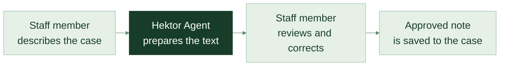
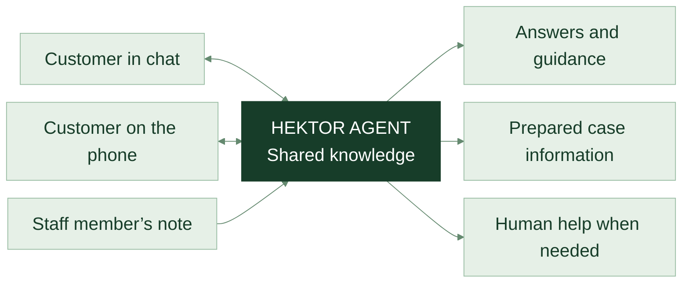

<DeckHeaderEnglish :chapter="0" />

MORE SERVICE. LESS ROUTINE WORK.

# Hektor Demo

An agent that helps customers and supports the whole team.

Web chatTelephoneDictation

Hektor’s knowledge. Hektor’s way of working. More questions handled at the same time.

<DeckIcon name="chat" /><strong>Hektor Agent</strong>One shared service

Helps the customerPrepares the caseSupports the team

<DeckFooter :page="1" note="Hektor Demo / A complete customer-service offering" />

---

<DeckHeaderEnglish :chapter="1" />

VALUE FOR THE CUSTOMER

# Faster help. An easier customer experience.

Customers should be able to get an answer and understand the next step.

<section>
<DeckIcon name="clock" />
<h2>Help when questions arise.</h2>
Answers to common questions, even outside staffed support hours.
</section><section>
<DeckIcon name="chat" />
<h2>Help in parallel.</h2>
Handle calls and chats in parallel, so more customers get a first answer.
</section><section>
<DeckIcon name="person" />
<h2>A way forward.</h2>
When a question needs a person, the context goes with it to the right colleague.
</section>

A more accessible first contact, with Hektor’s people close at hand.

<DeckFooter :page="2" note="Hektor Demo / How the service could work" />

---

<DeckHeaderEnglish :chapter="1" />

VALUE FOR THE TEAM

# The same questions. Less repeated work.

The same questions, explanations and notes take time every day.

<section>TODAY<h2>Each question takes staff time.</h2>
A staff member finds the answer, explains the same thing again and writes a note.

Find the answerExplainDocument
</section>
<DeckIcon name="arrow" />
<section class="sv-after">WITH HEKTOR AGENT<h2>Knowledge can help more people.</h2>
The agent guides customers with approved answers and prepares a brief for the next step.

Reuse knowledgeSupportFollow up
</section>

More time for customer cases that need experience, responsibility and personal contact.

<DeckFooter :page="3" note="Hektor Demo / How the service could work" />

---

<DeckHeaderEnglish :chapter="2" />

ONE COMPLETE OFFERING

# One agent. Three ways to help.

The same knowledge and rules carry across channels.

<section>
<DeckIcon name="chat" />
<h2>Web chat</h2>
Customers type a question and get help directly on the website.
</section><section>
<DeckIcon name="phone" />
<h2>Telephone</h2>
Customers speak Swedish and receive a clear answer or help with the next step.
</section><section>
<DeckIcon name="mic" />
<h2>Dictation</h2>
Staff describe what happened. The agent prepares a clear case note.
</section>

<b>Hektor Agent</b> connects customer questions, guidance and documentation.

<DeckFooter :page="4" note="Hektor Demo / How the service could work" />

---

<DeckHeaderEnglish :chapter="2" />

EXAMPLE / WEB CHAT

# How customers could get help in chat.

<DeckIcon name="chat" />

<b>Hektor Agent</b>Here to help you
EXAMPLE

How does Wi-Fi calling work?

You make calls over Wi-Fi instead of the mobile network. Your phone needs to support the service.<a href="https://hektormobil.se/kontakta-oss"><DeckIcon name="link" />Hektor’s frequently asked questions</a>

<DeckIcon name="person" />Talk to support

If support is closed, you can leave a contact request.

1
<h2>A clear answer.</h2>
Customers get an explanation based on Hektor’s own information.

2
<h2>A clear next step.</h2>
Customers can move on to a person when needed.

<DeckIcon name="arrow" />Help without unnecessary detours.

<DeckFooter :page="5" note="Hektor Demo / Illustrative dialogue based on Hektor’s FAQ, S18" />

---

<DeckHeaderEnglish :chapter="2" />

YOU OWN THE CONTENT

# Hektor’s knowledge behind every answer.

Customers should receive help based on information you stand behind.

HEKTOR’S SOURCE MATERIAL

<DeckIcon name="book" />FAQs &amp; guidance

<DeckIcon name="document" />Services &amp; terms

<DeckIcon name="arrow" />

<DeckIcon name="chat" />

HEKTOR AGENT
<h2>Find the answer. Explain it clearly.</h2>

<DeckIcon name="arrow" />

VALUE FOR THE CUSTOMER
<h2>Easier to understand.</h2>
An answer that helps the customer move forward.

<DeckIcon name="link" />Hektor’s own information

<DeckIcon name="person" /><strong>Hektor decides.</strong>You approve answers, rules and when a person takes over.

<DeckFooter :page="6" note="Hektor Demo / How the service could work" />

---

<DeckHeaderEnglish :chapter="2" />

EXAMPLE / TELEPHONE SUPPORT IN SWEDISH

# The same help when customers call.

ILLUSTRATIVE CONVERSATION

<b>Hektor</b>
Hello! You’re speaking with Hektor’s AI assistant. I can help with common questions or help you reach support.

<b>Customer</b>
How does Wi-Fi calling work?

<b>Hektor</b>
You make calls over Wi-Fi instead of the mobile network. Your phone needs to support the service.

<b>Customer</b>
Can you check my subscription?

<b>Hektor</b>
I cannot see your subscription details here. I’ll help you reach support.

Customers get help with what the agent can answer and a clear way forward.

<DeckFooter :page="7" note="Hektor Demo / Illustrative conversation / General information: Hektor’s FAQ, S18" />

---

<DeckHeaderEnglish :chapter="2" />

AN EASIER HANDOVER

# The next colleague gets the context.

Customers should not have to start again when a person takes over.

<DeckIcon name="chat" />
<h2>The customer needs more help.</h2>
The agent gathers the question and what has already been said.

<DeckIcon name="document" />
<h2>A clear brief goes with the case.</h2>
What the customer wants, what has been done and the next step.

<DeckIcon name="person" />
<h2>The right person takes over.</h2>
Immediately when possible, otherwise through agreed follow-up.

<DeckIcon name="document" />BRIEF FOR SUPPORTExample
<h2>Subscription question</h2><dl><dt>Customer’s request</dt><dd>Check the subscription</dd><dt>Explained</dt><dd>How Wi-Fi calling works</dd><dt>Check made</dt><dd>No subscription check</dd></dl>
<DeckIcon name="arrow" />
<b>Next step</b>Support helps the customer move forward.

<DeckFooter :page="8" note="Hektor Demo / How the service could work" />

---

<DeckHeaderEnglish :chapter="2" />

DICTATION FOR STAFF

# Describe what happened. Get the note ready.

Less time facing an empty case field after a customer interaction.

EXAMPLE CASE BRIEF
<b>Customer’s question</b> · What we know · What has been done · Next step · Who follows up

The agent prepares. The staff member checks and approves.

<DeckFooter :page="9" note="Hektor Demo / How the service could work" />

---

<DeckHeaderEnglish :chapter="3" />

CONFIDENCE AND CONTROL

# Hektor sets the boundaries.

The service should follow your rules in every customer interaction.

<section>
<DeckIcon name="book" />
<h2>You choose the information.</h2>
The agent should use Hektor’s approved answers and guidance.
</section><section>
<DeckIcon name="lock" />
<h2>You control access.</h2>
Personal information requires the right permissions and an approved identity check.
</section><section>
<DeckIcon name="person" />
<h2>A person can take over.</h2>
Customers should be able to get further help when the question requires it or something goes wrong.
</section>

General help first. Personal support requires approved integrations and checks.

<DeckFooter :page="10" note="Hektor Demo / How the service could work" />

---

<DeckHeaderEnglish :chapter="3" />

A NEW WAY TO SHARE THE WORK

# The agent handles routine work. The team takes it forward.

<section class="agent-role">

<DeckIcon name="chat" />
HEKTOR AGENT
<h2>The recurring work</h2><ul class="check-list"><li><DeckIcon name="check" />Explain common questions</li><li><DeckIcon name="check" />Guide people to the right next step</li><li><DeckIcon name="check" />Prepare case information</li></ul>
The same knowledge can help many people.
</section><section class="human-role">

<DeckIcon name="person" />
HEKTOR’S TEAM
<h2>The work that needs judgment</h2><ul class="check-list"><li><DeckIcon name="check" />Handle exceptions and sensitive questions</li><li><DeckIcon name="check" />Take responsibility for decisions and promises</li><li><DeckIcon name="check" />Develop the customer relationship</li></ul>
More room for personal service.
</section>

<DeckFooter :page="11" note="Hektor Demo / How the service could work" />

---

<DeckHeaderEnglish :chapter="3" />

GROW WITH DEMAND

# More customer contacts with the same team.

One shared agent can support several staff members at the same time.

The potential is in automating recurring tasks across the whole team.

<DeckFooter :page="12" note="Hektor Demo / Capacity is adapted to traffic and the agreed scope" />

---

<DeckHeaderEnglish :chapter="4" />

AN OFFERING THAT FITS TOGETHER

# This is the value for Hektor.

From the first question to a clear next step.

<section>01
<h2>More accessible customer service</h2>
Help with common questions through chat and telephone.

</section><section>02
<h2>Less recurring work</h2>
The same approved knowledge can help more customers.

</section><section>03
<h2>Easier documentation</h2>
Dictation and prepared case information support staff.

</section><section>04
<h2>Hektor stays in control</h2>
You decide on information, access and human follow-up.

</section>

<DeckFooter :page="13" note="Hektor Demo / Customer value, staff support and control" />

---

<DeckHeaderEnglish :chapter="4" />

OUR OFFER TO HEKTOR

# One agent. Value for a whole team.

1
<strong>Hektor Agent</strong>
at the cost of one support employee

<h2>Potential to automate a whole team’s recurring work.</h2>
More customers get help. Less routine work for staff. Hektor stays in control.

Web chat · Telephone · DictationOne shared service. Value in every customer interaction.

<DeckFooter :page="14" note="Scope and cost are defined in a quote. The level of automation has not yet been measured." />

