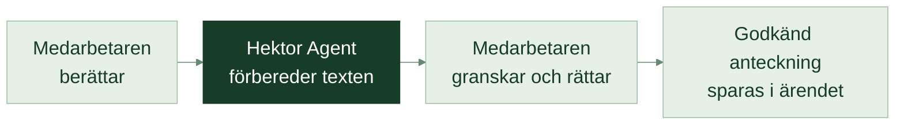
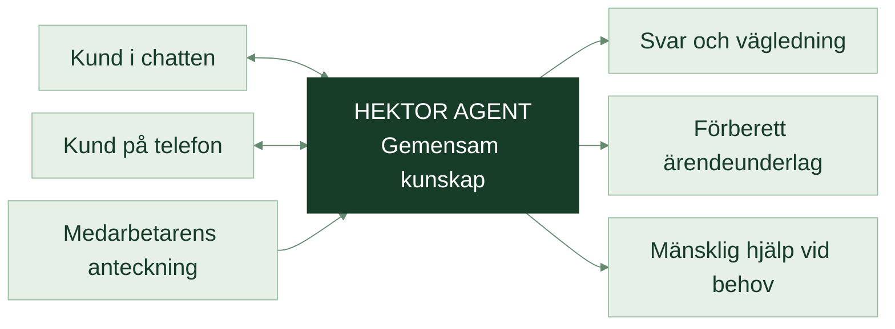

<DeckHeader :chapter="0" />

MER SERVICE. MINDRE RUTINARBETE.

# Hektor Demo

En agent som hjälper kunderna och avlastar hela teamet.

WebbchattTelefonDiktering

Hektors kunskap. Hektors arbetssätt. Fler frågor hanterade på samma gång.

<DeckIcon name="chat" /><strong>Hektor Agent</strong>En gemensam tjänst

Hjälper kundenFörbereder ärendetAvlastar teamet

<DeckFooter :page="1" note="Hektor Demo / Ett samlat erbjudande för kundservice" />

<!--
Öppna med värdet: en gemensam agent som kan hjälpa kunder i chatten och på telefon samt förbereda personalens dokumentation. Hektor Demo är presentationens namn; Hektor Agent är tjänsten. Exemplen visar det tänkta erbjudandet, inte en driftsatt telefonlösning. Ingen faktisk Hektor-koppling eller uppnådd kapacitet är verifierad i detta presentationsrepo.
-->

---

<DeckHeader :chapter="1" />

VÄRDET FÖR KUNDEN

# Snabbare hjälp. En enklare kundvardag.

Kunden ska kunna få ett svar och förstå nästa steg.

<section>
<DeckIcon name="clock" />
<h2>Hjälp när frågan uppstår.</h2>
Vanliga frågor kan få svar även när den bemannade supporten är stängd.
</section><section>
<DeckIcon name="chat" />
<h2>Flera får hjälp samtidigt.</h2>
Samtal och chattar kan hanteras parallellt, så fler kunder kan få ett första svar.
</section><section>
<DeckIcon name="person" />
<h2>En väg vidare.</h2>
När en fråga behöver en människa följer bakgrunden med till rätt person.
</section>

En tillgängligare första kontakt, med Hektors människor nära till hands.

<DeckFooter :page="2" note="Hektor Demo / Så kan tjänsten fungera" />

<!--
Tre tänkta kundfördelar: tillgänglighet, parallell hjälp och en tydlig väg vidare. Lova inte obegränsad samtidighet, noll kötid eller oavbruten drift. Kapacitet dimensioneras efter trafik och leverantörsvillkor. Mänsklig hjälp beror på bemanning; när supporten är stängd ska en överenskommen uppföljning erbjudas.
-->

---

<DeckHeader :chapter="1" />

VÄRDET FÖR TEAMET

# Samma frågor. Mindre dubbelarbete.

Samma frågor, förklaringar och anteckningar tar tid varje dag.

<section>I DAG<h2>Varje fråga kräver ny arbetstid.</h2>
En medarbetare letar upp svaret, förklarar samma sak igen och skriver en anteckning.

Hitta svaretFörklaraDokumentera
</section>
<DeckIcon name="arrow" />
<section class="sv-after">MED HEKTOR AGENT<h2>Kunskapen kan hjälpa fler.</h2>
Agenten använder godkända svar, guidar kunden och förbereder underlaget för nästa steg.

Återanvänd kunskapAvlastaFölj upp
</section>

Mer tid för de kundärenden som behöver erfarenhet, ansvar och personlig kontakt.

<DeckFooter :page="3" note="Hektor Demo / Så kan tjänsten fungera" />

<!--
Detta är en jämförelse av arbetssätt, inte en mätning av Hektors nuvarande process eller sparade timmar. Förklara konkret vilka återkommande arbetsmoment tjänsten är avsedd att automatisera. Att dokumentation förbereds innebär inte att ett ärende redan är sparat i Hektors system.
-->

---

<DeckHeader :chapter="2" />

ETT SAMLAT ERBJUDANDE

# En agent. Tre sätt att skapa nytta.

Samma kunskap och regler följer med mellan kanalerna.

<section>
<DeckIcon name="chat" />
<h2>Webbchatt</h2>
Kunden skriver en fråga och får hjälp direkt på webbplatsen.
</section><section>
<DeckIcon name="phone" />
<h2>Telefon</h2>
Kunden pratar på svenska och får ett begripligt svar eller hjälp vidare.
</section><section>
<DeckIcon name="mic" />
<h2>Diktering</h2>
Medarbetaren berättar vad som hänt. Agenten förbereder en tydlig ärendeanteckning.
</section>

<b>Hektor Agent</b> knyter ihop kundfrågor, vägledning och dokumentation.

<DeckFooter :page="4" note="Hektor Demo / Så kan tjänsten fungera" />

<!--
Skilj på kundkanaler och personalens arbetsflöde. Chatt och telefon ger kundhjälp; diktering hjälper personalen att dokumentera. Telefon och ärendesystem behöver tekniska kopplingar före drift. Leverantörsnamn och protokoll hör hemma i bakgrundsmaterialet, inte i denna översikt.
-->

---

<DeckHeader :chapter="2" />

EXEMPEL / WEBBCHATT

# Så kan kunden få hjälp i chatten.

<DeckIcon name="chat" />

<b>Hektor Agent</b>Här för att hjälpa dig
EXEMPEL

Hur fungerar wifi-samtal?

Du ringer via wifi i stället för mobilnätet. Din telefon behöver stödja tjänsten.<a href="https://hektormobil.se/kontakta-oss"><DeckIcon name="link" />Hektors vanliga frågor</a>

<DeckIcon name="person" />Prata med supporten

Är supporten stängd kan du lämna en kontaktförfrågan.

1
<h2>Ett begripligt svar.</h2>
Kunden får en förklaring med stöd i Hektors egen information.

2
<h2>Ett tydligt nästa steg.</h2>
Kunden kan gå vidare till en människa när det behövs.

<DeckIcon name="arrow" />Hjälp utan krångliga omvägar.

<DeckFooter :page="5" note="Hektor Demo / Illustrativ dialog utifrån Hektors vanliga frågor, S18" />

<!--
Dialogen är illustrativ och bygger på Hektors allmänna förklaring av wifi-samtal. Källa S18: https://hektormobil.se/kontakta-oss (forskningsunderlag kontrollerat 10 september 2026). Bilden är en redigerbar presentation, inte en livechatt. Tillgänglighet, kontaktförfrågningar och överlämning ska följa Hektors godkända arbetssätt.
-->

---

<DeckHeader :chapter="2" />

NI ÄGER INNEHÅLLET

# Hektors kunskap bakom varje svar.

Kunderna ska få hjälp utifrån den information ni står bakom.

HEKTORS UNDERLAG

<DeckIcon name="book" />Vanliga frågor &amp; vägledning

<DeckIcon name="document" />Tjänster &amp; villkor

<DeckIcon name="arrow" />

<DeckIcon name="chat" />

HEKTOR AGENT
<h2>Hitta svaret. Förklara enkelt.</h2>

<DeckIcon name="arrow" />

KUNDENS NYTTA
<h2>Lättare att förstå.</h2>
Ett svar som hjälper kunden vidare.

<DeckIcon name="link" />Hektors egen information

<DeckIcon name="person" /><strong>Hektor bestämmer.</strong>Ni godkänner svar, regler och när en människa tar över.

<DeckFooter :page="6" note="Hektor Demo / Så kan tjänsten fungera" />

<!--
Bilden visar det tänkta arbetssättet. Hektor behöver äga och hålla underlaget aktuellt. En källa hjälper granskning men garanterar inte korrekthet. Vid motstridig eller saknad information ska agenten kunna avstå från att svara och hänvisa vidare. Kopplingen till den befintliga agentens kunskapshantering är en förutsättning att verifiera.
-->

---

<DeckHeader :chapter="2" />

EXEMPEL / TELEFON PÅ SVENSKA

# Samma hjälp, även när kunden ringer.

ILLUSTRATIVT SAMTAL

<b>Hektor</b>
Hej! Du pratar med Hektors AI-assistent. Jag kan hjälpa dig med vanliga frågor eller hjälpa dig att nå supporten.

<b>Kunden</b>
Hur fungerar wifi-samtal?

<b>Hektor</b>
Du ringer via wifi i stället för mobilnätet. Din telefon behöver stödja tjänsten.

<b>Kunden</b>
Kan du kontrollera mitt abonnemang?

<b>Hektor</b>
Jag kan inte se dina abonnemangsuppgifter här. Jag hjälper dig vidare till supporten.

Kunden får hjälp med det agenten kan svara på och en tydlig väg vidare.

<DeckFooter :page="7" note="Hektor Demo / Illustrativt samtal / Allmän information: Hektors FAQ, S18" />

<!--
Illustrativt telefonsamtal, inte inspelning eller testresultat. Allmänna svaret bygger på Hektors FAQ, S18 https://hektormobil.se/kontakta-oss . Agenten har ingen verifierad åtkomst till abonnemang i denna demo. Inledningen tydliggör att kunden talar med AI; den är inte ett godkänt fullständigt integritets- eller inspelningsmeddelande. Telefonkoppling, svensk talupplevelse och överlämning behöver verifieras före användning.
-->

---

<DeckHeader :chapter="2" />

EN ENKLARE ÖVERLÄMNING

# Nästa kollega får med sig bakgrunden.

Kunden ska inte behöva börja om när en människa tar över.

<DeckIcon name="chat" />
<h2>Kunden behöver mer hjälp.</h2>
Agenten samlar frågan och det som redan har sagts.

<DeckIcon name="document" />
<h2>Ett tydligt underlag följer med.</h2>
Vad kunden vill, vad som är gjort och nästa steg.

<DeckIcon name="person" />
<h2>Rätt person tar vid.</h2>
Direkt när det går, annars enligt överenskommen uppföljning.

<DeckIcon name="document" />UNDERLAG TILL SUPPORTExempel
<h2>Fråga om abonnemang</h2><dl><dt>Kundens önskemål</dt><dd>Kontrollera abonnemanget</dd><dt>Redan förklarat</dt><dd>Så fungerar wifi-samtal</dd><dt>Kontroll utförd</dt><dd>Ingen abonnemangskontroll</dd></dl>
<DeckIcon name="arrow" />
<b>Nästa steg</b>Supporten hjälper kunden vidare.

<DeckFooter :page="8" note="Hektor Demo / Så kan tjänsten fungera" />

<!--
Överlämning av ett telefonsamtal och leverans av ärendeunderlag är separata kopplingar. Ärendet i bilden är fiktivt. Bekräfta mottagare, öppettider och uppföljning vid upptaget eller uteblivet svar. Misslyckad ärendeleverans ska fångas upp och försöka igen utan att blockera en brådskande kontakt med en människa. Underlaget ska skilja vad kunden sagt från vad systemen faktiskt bekräftat.
-->

---

<DeckHeader :chapter="2" />

DIKTERING FÖR MEDARBETARNA

# Berätta vad som hänt. Få anteckningen klar.

Mindre tid framför ett tomt ärendefält efter kundkontakten.

EXEMPEL PÅ UNDERLAG
<b>Kundens fråga</b> · Vad vi vet · Vad som har gjorts · Nästa steg · Vem som följer upp

Agenten förbereder. Medarbetaren kontrollerar och godkänner.

<DeckFooter :page="9" note="Hektor Demo / Så kan tjänsten fungera" />

<!--
Separat personalflöde för diktering eller godkänd ljudfil. En transkriptionstjänst gör ljudet till text; Hektor förbereder ett utkast och en behörig ärendekoppling sparar först efter granskning. Föreslagen leverantör finns i bakgrundsmaterialet S12: https://elevenlabs.io/docs/overview/capabilities/speech-to-text . Namn, siffror, datum, löften och osäkra fält ska granskas. Dikterade instruktioner får inte direkt ändra ett kundkonto. Återanvänd AI-samtalets text och bekräftade resultat utan en extra transkribering som standard. Den mänskliga delen av ett överlämnat samtal kräver separat beslutad inspelning/transkribering; den ingår inte automatiskt.
-->

---

<DeckHeader :chapter="3" />

TRYGGHET OCH KONTROLL

# Hektor sätter gränserna.

Tjänsten ska följa era regler i varje kundkontakt.

<section>
<DeckIcon name="book" />
<h2>Ni väljer informationen.</h2>
Agenten ska utgå från Hektors godkända svar och vägledning.
</section><section>
<DeckIcon name="lock" />
<h2>Ni styr åtkomsten.</h2>
Personliga uppgifter kräver rätt behörighet och en godkänd identitetskontroll.
</section><section>
<DeckIcon name="person" />
<h2>En människa kan ta över.</h2>
Kunden ska kunna få hjälp vidare när frågan kräver det eller något går fel.
</section>

Allmän hjälp först. Personlig support förutsätter godkända kopplingar och kontroller.

<DeckFooter :page="10" note="Hektor Demo / Så kan tjänsten fungera" />

<!--
Detta är krav på den föreslagna tjänsten, inte verifierad säkerhet eller juridiskt godkännande. Identitet och behörigheter måste styras i Hektors system; ett påstående i chatten eller samtalet ger inte åtkomst. Telefonnummer ensamt är inte identifiering. Lova inte BankID eller kundkontouppslag som befintligt. Databehandling, leverantörer, meddelanden till kunden, lagring och felvägar behöver granskas. Den som inte verifierats ska ändå kunna nå en människa.
-->

---

<DeckHeader :chapter="3" />

ETT NYTT SÄTT ATT FÖRDELA ARBETET

# Agenten tar rutinen. Teamet tar det vidare.

<section class="agent-role">

<DeckIcon name="chat" />
HEKTOR AGENT
<h2>Det återkommande arbetet</h2><ul class="check-list"><li><DeckIcon name="check" />Förklara vanliga frågor</li><li><DeckIcon name="check" />Guida till rätt nästa steg</li><li><DeckIcon name="check" />Förbereda ärendeunderlag</li></ul>
Samma kunskap kan hjälpa många.
</section><section class="human-role">

<DeckIcon name="person" />
HEKTORS TEAM
<h2>Det som kräver omdöme</h2><ul class="check-list"><li><DeckIcon name="check" />Hantera undantag och känsliga frågor</li><li><DeckIcon name="check" />Ta ansvar för beslut och löften</li><li><DeckIcon name="check" />Utveckla kundrelationen</li></ul>
Mer utrymme för mänsklig service.
</section>

<DeckFooter :page="11" note="Hektor Demo / Så kan tjänsten fungera" />

<!--
Visa vilka arbetsmoment som kan flyttas från repetitiv handläggning till automation. Det betyder inte att alla medarbetaruppgifter försvinner. Kontoändringar, kommersiella åtaganden och känsliga ärenden ligger kvar hos behöriga personer tills särskilt godkända funktioner finns. Undvik påhittade antal ersatta medarbetare eller sparade timmar.
-->

---

<DeckHeader :chapter="3" />

VÄXA MED BEHOVET

# Fler kundkontakter med samma team.

En gemensam agent kan avlasta flera medarbetare samtidigt.

Potentialen ligger i att automatisera återkommande arbetsmoment över hela teamet.

<DeckFooter :page="12" note="Hektor Demo / Kapacitet anpassas till trafik och överenskommen omfattning" />

<!--
En agent betyder här en gemensam konfigurerad tjänst, inte en obegränsad teknisk instans. Samtidighet, svarstid och tillgänglighet beror på dimensionering, trafik och avtal. Figuren visar tänkta parallella flöden utan uppmätt kapacitetslöfte. Ambitionen är teamomfattande avlastning, inte ett verifierat löfte om att ersätta ett visst antal personer.
-->

---

<DeckHeader :chapter="4" />

ETT ERBJUDANDE SOM HÄNGER IHOP

# Det här är värdet för Hektor.

Från den första frågan till ett tydligt nästa steg.

<section>01
<h2>Tillgängligare kundservice</h2>
Hjälp med vanliga frågor via chatt och telefon.

</section><section>02
<h2>Mindre återkommande arbete</h2>
Samma godkända kunskap kan hjälpa fler kunder.

</section><section>03
<h2>Enklare dokumentation</h2>
Diktering och förberedda underlag avlastar medarbetarna.

</section><section>04
<h2>Hektor behåller kontrollen</h2>
Ni bestämmer information, åtkomst och mänsklig uppföljning.

</section>

<DeckFooter :page="13" note="Hektor Demo / Kundnytta, avlastning och kontroll" />

<!--
Samla nyttan utan att återgå till teknik eller en förfrågan om pilot. Chatt, telefon och personaldiktering ingår i erbjudandets tänkta helhet; exakt leveransomfattning och löpande kostnader fastställs i offert. Inga av dessa mål är uppmätta besparingar i denna demo.
-->

---

<DeckHeader :chapter="4" />

VÅRT ERBJUDANDE TILL HEKTOR

# En agent. Värde för ett helt team.

1
<strong>Hektor Agent</strong>
till kostnaden av en supportmedarbetare

<h2>Potential att automatisera ett helt teams återkommande arbete.</h2>
Fler kunder får hjälp. Mindre rutin för medarbetarna. Hektor behåller kontrollen.

Webbchatt · Telefon · DikteringEn gemensam tjänst. Nytta i varje kundkontakt.

<DeckFooter :page="14" note="Erbjudandets omfattning och kostnadsram preciseras i offert. Automatiseringsgrad är ännu inte uppmätt." />

<!--
Avsluta på erbjudandet, inte med en fråga om pilot. Kostnadsjämförelsen kommer från uppdragsgivarens uttryckliga kommersiella inriktning: en agent ska erbjudas till kostnaden av en supportmedarbetare. Den är inte en oberoende marknadsuppgift eller färdig kalkyl. Innan offert behöver parterna definiera om jämförelsen avser lön eller full arbetsgivarkostnad och vilka införande-, drift-, telefoni-, användnings- och granskningskostnader som ingår. Inga kronor, lönebelopp eller besparingsprocent är fastställda här. Formuleringen om ett helt team avser potentialen att automatisera dess återkommande arbete; den lovar inte att all mänsklig support kan ersättas. Kapacitet och faktisk automatiseringsgrad återstår att verifiera.
-->
